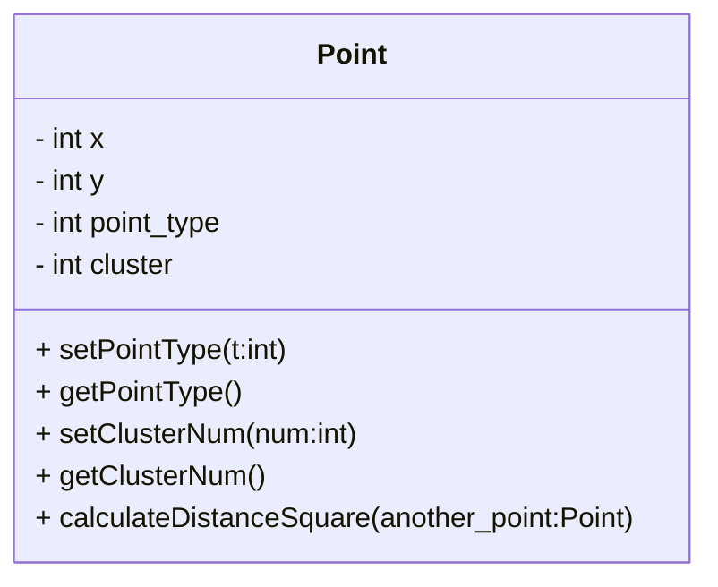
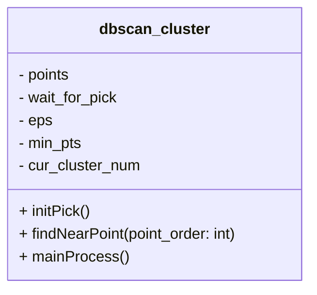

# DB SCAN Cluster

## 1 简介 Introduction

> DBSCAN（Density-Based Spatial Clustering of Applications with Noise，具有噪声的基于密度的聚类方法）是一种基于密度的空间聚类算法。该算法将具有足够密度的区域划分为簇，并在具有噪声的空间数据库中发现任意形状的簇，它将簇定义为密度相连的点的最大集合。
>
> 
>
> 作者：dreampai
> 链接：https://www.jianshu.com/p/e594c2ce0ac0
> 来源：简书
> 著作权归作者所有。商业转载请联系作者获得授权，非商业转载请注明出处。

## 2 算法原理

### 2.1 超参数

- 搜索半径```Eps```: 以某点为圆心, 以```Eps```为半径的圆称作该点的邻域
- 点数阈值```MinPts```: 某点邻域范围内的样本数超过该阈值, 才会将该点视为某个簇的**核心点(```CORE```, 2.2中将介绍)**

### 2.2 点的分类

1. 核心点(```CORE```): 某点邻域范围内的样本数超过```MinPts```
2. 边界点(```BOARD```): 某点邻域范围内的样本数**未**超过```MinPts```, 但是在其他核心点的邻域范围内
3. 噪声(```NOISE```): 既不是核心点也不是边界点

## 3 算法步骤


> - 首选任意选取一个点，然后找到到这个点距离小于等于 eps 的所有的点。如果距起始点的距离在 eps 之内的数据点个数小于 ```MinPts```，那么这个点被标记为**噪声。**如果距离在 eps 之内的数据点个数大于 ```MinPts```，则这个点被标记为**核心样本**，并被分配一个新的簇标签。
>
> - 然后访问该点的所有邻居（在距离 ```Eps``` 以内）。如果它们还没有被分配一个簇，那么就将刚刚创建的新的簇标签分配给它们。如果它们是核心样本，那么就依次访问其邻居，以此类推。簇逐渐增大，直到在簇的 ```Eps``` 距离内没有更多的核心样本为止。
>
> - 选取另一个尚未被访问过的点，并重复相同的过程。
>
> 
>
> 作者：dreampai
> 链接：https://www.jianshu.com/p/e594c2ce0ac0
> 来源：简书
> 著作权归作者所有。商业转载请联系作者获得授权，非商业转载请注明出处。

## 4 类/方法的设计

### 4.1 ```Point```类



```x```: x轴坐标

```y```: y轴坐标

```point_type```: 点类型(**2.2**)

```cluster```: 簇号

```calculateDistanceSquare(another_point)```: 计算到另一个点```another_point```欧式距离的平方

### 4.2 ```dbscan_cluster```类



```points```: 所有点集合

```wait_for_pick```: 还未访问的点的序号集合

```eps```: 超参数```Eps```(见 **2.1**)

```min_pts```: 超参数```min_pts```(见 **2.1**)

```cur_cluster_num```: 当前标记到的簇号

```initPick()```: 在```wait_for_pick```中随机挑选一个点，返回点在```points```中的序号

```findNearPoint(point_order)```: 找出第```point_order```个点的所有邻点

```mainProcess()```: **DBSCAN聚类的过程函数**(见 3)

### 4.3 ```dbScanCluster```方法

```python
def dbScanCluster(total_size=200, xScale=1000, yScale=1000, eps=80, min_pts=3)
```

**DBSCAN聚类的入口**

输入为点数```total_size```, 点生成的x轴范围```xScale```, 点生成的y轴范围```yScale```以及超参数```Eps```和 ```min_pts```.

在 **([0, ```xScale```], [0, ```yScale```])** 范围内随机生成```total_size```个点

输出```x```(所有点的横坐标), ```y```(所有点的纵坐标), ```label```(所有点的标签), ```maxCluster```(簇的个数)

### 4.4 ```scatterDifferent```方法

```python
def scatterDifferent(x, y, label, cluster_num, color_list, marker_list):
```

==前四个参数就是 4.3 的返回值==! 后面两个参数分别是==备选颜色列表==和==备选特殊标记列表==

这个方法只用来**画图**, ==无任何输出==

## 5 测试结果

```python
dbScanCluster(total_size=100, eps=100, min_pts=2)
```


> 小彩蛋
>
> ## DBSCAN 的参数选择
>
> - eps 设置得非常小，则意味着没有点是核心样本，可能会导致所有点被标记为噪声
> - eps 设置得非常大，可能会导致所有点形成单个簇。
> - 虽然不需要显示设置簇的个数，但设置 eps 可以隐式地控制找到 eps 的个数。
> - 使用 StandarScaler 或 MinMaxScaler 对数据进行缩放，有时更容易找到 eps 的较好取值。因为使用缩放技术将确保所有特征具有相似的范围。
>
> 
>
> 作者：dreampai
> 链接：https://www.jianshu.com/p/e594c2ce0ac0
> 来源：简书
> 著作权归作者所有。商业转载请联系作者获得授权，非商业转载请注明出处。

## 附 代码

### 1 ```main.py```

```python
from dbscan_cluster import dbScanCluster
from config import scatterDifferent


# 主入口
if __name__ == '__main__':
    x, y, label, maxCluster = dbScanCluster(total_size=100, eps=100, min_pts=2)
    scatterDifferent(x, y, label, maxCluster, color_list=['#8E05C2', '#A9333A', '#3E7C17', 'blue', '#F4A442', '#FF9292', '#1DB9C3', '#6D9886'], marker_list=['^', 'o', '1', 'p', 's'])
```

### 2 ```dbscan_cluster.py```

```python
from point import *
import random
import queue
from generate_random_points import *
import matplotlib.pyplot as plt


class dbscan_cluster:
    def __init__(self, x_total, y_total, eps: int, min_pts: int) -> object:
        """
        :param eps: int, 表示半径
        :param min_pts: int, 最少要包含多少点
        """
        self.points = [point(x_total[i], y_total[i]) for i in range(len(x_total))]
        self.wait_for_pick = [i for i in range(len(self.points))]  # 可选取的点
        self.eps = eps
        self.min_pts = min_pts
        self.cur_cluster_num = 0  # 簇序号从0开始

    def printAllPoints(self):
        for p in self.points:
            print('({0}, {1})'.format(p.x_pos, p.y_pos))

    def getClusterNum(self):
        return self.cur_cluster_num

    def initPick(self):
        """
        :return: 在wait_for_pick中随机挑选一个点，返回点在points中的序号
        """
        cur_order = random.randint(0, len(self.wait_for_pick) - 1)  # wait_for_pick中的第cur_order个序号
        cur_pick = self.wait_for_pick[cur_order]  # 存入cur_pick
        self.wait_for_pick.pop(cur_order)  # 再删除
        return cur_pick

    def findNearPoint(self, cur_pick):
        """
        :param cur_pick: int, 表示当前选中的点序号
        :return: 与当前点距离在sqrt(eps^2)内的所有点序号
        """
        near_points = []
        for p in range(len(self.points)):
            if p == cur_pick:  # 同一个点, 跳过
                continue
            else:  # 其他点, 计算一下
                if self.points[cur_pick].calculateDistanceSquare(self.points[p]) <= self.eps ** 2:
                    near_points.append(p)
        return near_points

    def mainProcess(self):
        while len(self.wait_for_pick) > 0:
            # 先随机选取点, 并且在wait_for_pick里面删除其序号
            pre_points = []  # 标记这一个簇已经找到的点
            seeds = queue.Queue()  # 创建一个种子点队列
            cur_pick = self.initPick()  # 获取一个随机点
            near_points = self.findNearPoint(cur_pick)  # 获取随机点的邻近点
            # 当前点的邻近点数量小于 min_pts, 标记为噪声点
            if len(near_points) < self.min_pts:
                self.points[cur_pick].setPointType(NOISE)  # 当前的点是个噪声点
            # 大于 min_pts, 标记为核心点
            elif len(near_points) > self.min_pts:
                self.points[cur_pick].setPointType(CORE)  # 当前的点是核心点
                self.points[cur_pick].setClusterNum(self.cur_cluster_num)  # 设置簇号
                pre_points.append(cur_pick)  # 当前点后续不必再遍历
                for near_point_index in near_points:  # 把它的邻近点全部加入到seeds队列
                    seeds.put(near_point_index)  # 把邻近点在points中的下标加入seeds队列
                    # wait_for_pick队列中需要删除这个邻近点下标
                    if self.wait_for_pick.count(near_point_index) > 0:  # 这个点下标在wait_for_pick队列中
                        self.wait_for_pick.pop(self.wait_for_pick.index(near_point_index))  # 那就pop掉
                while not seeds.empty():  # 只有seeds中还有点数时才继续执行
                    head_point_index = seeds.get()  # 获取队列头部元素, get()方法会在取元素的同时删除队列中的它
                    pre_points.append(head_point_index)  # 后续不必再找它
                    if self.wait_for_pick.count(head_point_index) > 0:  # 这个点下标在wait_for_pick队列中
                        self.wait_for_pick.pop(self.wait_for_pick.index(head_point_index))  # 那就pop掉
                    self.points[head_point_index].setClusterNum(self.cur_cluster_num)  # 在这个seeds里能找到， 说明簇号还是一样
                    if self.points[head_point_index].getPointType() == UNVISITED:  # 还没标记过
                        cur_near_pts = self.findNearPoint(head_point_index)  # 查看一下它的邻近点
                        if len(cur_near_pts) > self.min_pts:  # 如果邻近点数量超过阈值
                            self.points[head_point_index].setPointType(CORE)  # 核心点
                            # 把邻近点全部加入seeds
                            for p in cur_near_pts:
                                if p not in pre_points:  # 没遍历过的邻近点才加入
                                    seeds.put(p)
                        else:  # 邻近点数量没到
                            self.points[head_point_index].setPointType(BOARD)  # 边界点
                    else:  # 已经被标记过
                        if self.points[head_point_index].getPointType() == NOISE:  # 之前是噪声
                            self.points[head_point_index].setPointType(BOARD)  # 现在改成边界点
                self.cur_cluster_num = self.cur_cluster_num + 1  # 下一个簇号

    def getAllCluster(self):
        """
        :return: 返回所有点的标签
        """
        return [self.points[i].getClusterNum() + 1 for i in range(len(self.points))]
        # +1 是为了防止标签为-1的点后续处理中下标越界

    def printPointAndLabel(self):
        """
        这个方法打印点信息，主要用来测试
        :return: 无返回值
        """
        cluster_list = [[] for i in range(self.cur_cluster_num)]
        for pot in range(len(self.points)):
            print(self.points[pot].getClusterNum(), self.cur_cluster_num)
            if self.points[pot].getClusterNum() > -1:
                cluster_list[self.points[pot].getClusterNum()].append(pot)
        for li in range(len(cluster_list)):
            if len(cluster_list[li]) > 0:
                print('cluster #{0}'.format(li))
                for i in cluster_list[li]:
                    print('({0}, {1})'.format(self.points[i].x, self.points[i].y))
                print('--------------')


def dbScanCluster(total_size=200, xScale=1000, yScale=1000, eps=80, min_pts=3):
    # 目前只支持生成随机点
    x, y = generate(total=total_size, x_scale=xScale, y_scale=yScale)  # 生成随机点
    db = dbscan_cluster(x, y, eps, min_pts)
    db.mainProcess()
    label = db.getAllCluster()
    maxCluster = db.getClusterNum()
    return x, y, label, maxCluster
```

### 3 ```Point.py```

```python
from config import *


class point:
    def __init__(self, x_pos, y_pos):
        self.x = x_pos
        self.y = y_pos
        self.point_type = UNVISITED  # 未被访问过
        self.cluster = NONE  # 还不属于任何簇

    @property
    def x_pos(self):
        return self.x

    @property
    def y_pos(self):
        return self.y

    def setPointType(self, t):
        self.point_type = t

    def getPointType(self):
        return self.point_type

    def setClusterNum(self, num):
        self.cluster = num

    def getClusterNum(self):
        return self.cluster

    def calculateDistanceSquare(self, another_point):
        return (self.x - another_point.x)**2 + (self.y - another_point.y)**2

```

### 4 ```Config.py```

```python
import matplotlib.pyplot as plt
import numpy as np


# 点类型参数值:
UNVISITED: int = -1  # 未被访问过
NOISE: int = 0  # 噪声点
CORE: int = 1  # 核心点
BOARD: int = 2  # 边缘点

# 点所属簇参数值:
NONE: int = -1


# 为不同组别绘图的功能函数
def scatterDifferent(x, y, label, cluster_num, color_list, marker_list):
    # 先根据label给不同的x和y分组
    x_group = [[] for i in range(cluster_num + 1)]
    y_group = [[] for i in range(cluster_num + 1)]
    for i in range(len(label)):
        x_group[label[i]].append(x[i])
        y_group[label[i]].append(y[i])
    fig, ax = plt.subplots()
    plt.scatter(np.array(x_group[0]), np.array(y_group[0]), c='black', label='NOISE')
    for cluster_order in range(1, len(x_group)):
        plt.scatter(np.array(x_group[cluster_order]), np.array(y_group[cluster_order]), c=color_list[cluster_order % len(color_list)], marker=marker_list[cluster_order % len(marker_list)], label=cluster_order)
    # plt.scatter(x, y, c=label, cmap='jet')
    plt.legend(bbox_to_anchor=(1.05, 0), loc=3, borderaxespad=0)
    # 让图例显示完全
    fig.subplots_adjust(right=0.8)
    # 显示图片
    plt.show()

```

### 5 ```generate_random_points.py```

```python
import random
import numpy as np


def generate(total=200, x_scale=1000, y_scale=1000):
    """
    :param total: 生成的所有点点数, 默认200
    :param x_scale: x轴上的最大取值, 最小为0
    :param y_scale: x轴上的最大取值, 最小为0
    :return: 返回x轴坐标点集合和y轴坐标点数组, 例如有两个点(1, 2), (3, 4), 返回的是[1 3],[2 4]
    """
    x = np.random.randint(x_scale, size=total)
    y = np.random.randint(y_scale, size=total)
    return x, y
```

